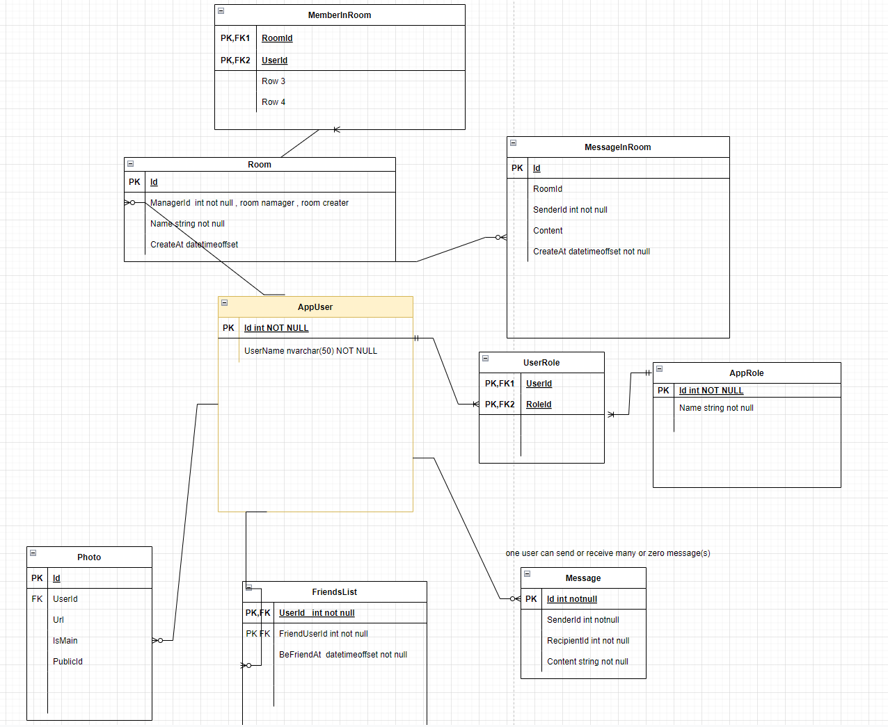
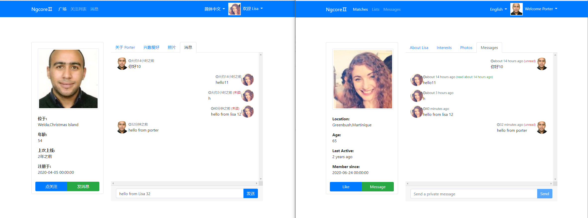

# chat-app

simple real time chat app base on signal-r

## Development

### Add Migration(s)

add migrations(s) by `dotnet ef`

```
dotnet ef migrations add MigrationName -p Infrastructure  -s ChatHub.API -c ChatAppContext -o Persistence\Migrations
```

or add migrations(s) in Visual Studio

```
PM> Add-Migration Migration(s)Name -Project Infrastructure -StartupProject ChatHub.API -Context ChatAppContext -OutputDir "Persistence\Migrations"
```

### ChatApp rely on redis and rabbitmq

run *redis* using docker

```
docker run --name myredis -d redis redis-server --save 60 1 --loglevel warning -p 6379:6379
```

run  *rabbitmq* using docker

```
docker run -d -p 15672:15672 -p 5672:5672 -p 5671:5671 --hostname my-rabbitmq --name my-rabbitmq-container rabbitmq:3-management
```

### Entity Relationship Diagram

you also can view [it](https://github.com/839928622/chat-app/tree/main/src/Assets/ERD) on [draw.io](https://app.diagrams.net/)



### chatting image



### Thanks for the following packages

<table>

<tr>
     <th>Main Tech</th>
     <th>Detail</th>
      <th>Description</th>

</tr >
<tr >
    <td rowspan="4">back-end: .NET Core</td>
    <td>efcore</td>
   <td>powerful orm data access tool</td>

</tr>
<tr>
    <td>Mapster</td>
 <td>light weight object mapping tool</td>

</tr>
<tr>
    <td>AspNetCore.Identity</td>
    <td>user managerment and signin managerment</td>

</tr>
<tr>
    <td>AspNetCore.SignalR</td>
    <td>real time communication library for server</td>
 <td>-</td>
</tr>
<tr>
    <td rowspan="5">front-end: Angular</td>
    <td>ngx-gallery</td>
    <td>photo gallery</td>

</tr>
<tr>
    <td >microsoft/signalr</td>
    <td >real time communication library for client in typescript</td>

</tr>
<tr>
    <td >ngx-translate/core</td>
    <td >i18n core</td>

</tr>
<tr>
    <td >ngx-translate/http-loader</td>
    <td >i18n http loader</td>

</tr>
<tr>
    <td >ng2-file-upload</td>
    <td >file upload control</td>

</tr>

</table>